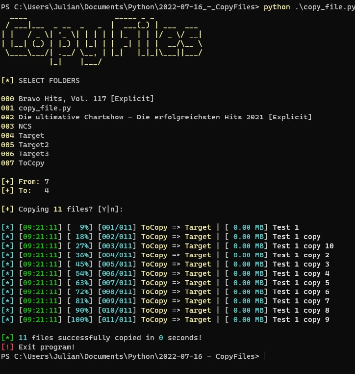

# CopyFilesCLI

## Screenshot

## Description
This little program can copy files from one folder to an other.
Python should be installed to use this program!

## Requirements
- colorama
- pyfiglet

## Platform
- Windows
- Linux
- Mac
